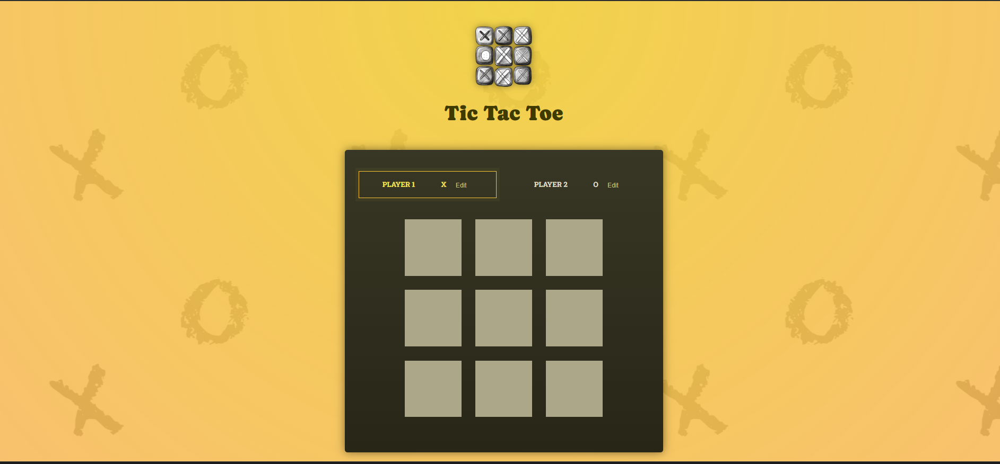
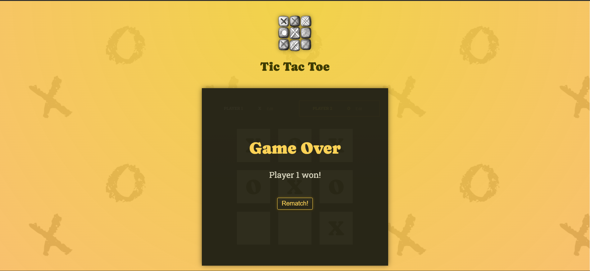

# Tic Tac Toe Game in React.js

## Overview

This project is a simple Tic Tac Toe game built using React.js as part of my learning journey. The game showcases key React concepts including state management, props, and component-based architecture.





## Features

- **Immutability of Objects**: Ensures predictable and manageable state updates.
- **useState Hook**: Manages state within functional components.
- **Props**: Facilitates data flow between components.
- **Lifting State Up**: Manages shared state efficiently.
- **Two-Way Binding**: Creates a responsive and interactive UI.

## Key Concepts

1. **Immutability of Objects**: Understanding how immutability works in React is crucial for managing state effectively. It ensures that state updates are predictable, which makes debugging and testing much easier.

2. **useState Hook**: This powerful hook allows for the management of state within components, providing a functional approach to state management compared to traditional class-based components.

3. **Props**: Props are essential in passing data between components, enabling the creation of reusable and dynamic UI elements.

4. **Lifting State Up**: By lifting the state up to a common ancestor, shared state is managed between multiple components, ensuring that the application logic remains centralized and manageable.

5. **Two-Way Binding**: Implementing two-way binding helps create a responsive and interactive UI, where user inputs are immediately reflected in the state and vice versa.

## Installation

1. **Clone the repository**:
    ```bash
    git clone https://github.com/your-username/tic-tac-toe-react.git
    ```

2. **Navigate to the project directory**:
    ```bash
    cd tic-tac-toe-react
    ```

3. **Install dependencies**:
    ```bash
    npm install
    ```

4. **Run the development server**:
    ```bash
    npm start
    ```

    The app should now be running on [http://localhost:3000](http://localhost:3000).

## Usage

1. Open your browser and navigate to [http://localhost:3000](http://localhost:3000).
2. Play the game by clicking on the squares to place X's and O's.
3. The game will automatically detect a win or a draw and display a message accordingly.


